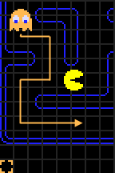

# Project Readme

There are ready and testable executable files for both windows and linux ie `pacman.exe` and `pacman` respectively.

If you wish to recompile the project choose either of these compilation steps based on your operating system.

## Compilation Instructions

To compile the project, you can choose between two methods: the original Linux-specific method or a multi-platform method using CMake.

#### Method 1: Linux-Specific Compilation

1. Ensure you have `g++` and the SFML library installed on your system.
2. Compile the project using the following command:

   ```bash
   g++ *.cpp -lsfml-graphics -lsfml-window -lsfml-system -o pacman
   ```

3. To run it, execute the `pacman` file:

   ```bash
   ./pacman
   ```

#### Method 2: Multi-Platform Compilation Using CMake

1. Ensure you have CMake and the SFML library installed on your system.
2. Execute the following commands in sequence to build the project:

   ```bash
   cmake -B build -DCMAKE_BUILD_TYPE=Release
   cmake --build build --config Release
   ```

3. A new directory will be created /build and the executable can be found in /build/bin under either of these names "pacman.exe" or "pacman".

4. [IMPORTANT] Move the executable in the root directory of the project so that the executable can fetch the png images from the assets directory.

5. You can execute the executable from the terminal as :
   ```bash
   ./pacman
   ```

By following these steps, you can compile and run the project on multiple platforms.

## Demo Samples

1. Sample game play
   <!--  -->
   

2. Game won screen
   <!--  -->
   

3. Game lost screen
   <!--  -->
   

## Gameplay Mechanics

The gameplay is centered around Pac-Man consuming all pellets while avoiding pursuit by the ghosts.
Each of the ghosts has 3 modes:

### i) Scatter Mode

• Default starting mode for all ghosts whereby they target their respective corners within the game map.

• The target corners are inaccessible and the ghosts cannot stop moving or reverse direction.

• They are forced to continue past the target but will turn back towards it as soon as possible.

• This results in each ghost's path eventually becoming a fixed loop in their corner.

• If left in Scatter mode, each ghost would remain in its loop indefinitely.

• However, the game's configuration limits the mode to the first 7 seconds of the game which later on switches to chase mode unless interrupted by Pac-Man eating an energizer causing a switch to frightened mode.


_Each ghost's target tile and eventual looping path, color-coded to match their own color._

### ii) Frightened Mode

• Occurs when Pac-Man consumes an energizer resulting in slow movement of the ghosts as well as switching color to dark blue.

• During this mode, Pac-Man can openly attack any of the ghosts without losing a life.

### iii) Chase Mode

• Occurs automatically after the 7 seconds of the scatter mode have elapsed.

• This causes the ghosts to target Pac-Man each in their unique way.

• During this mode, Pac-Man is vulnerable to the ghosts and contact between Pac-Man and any of the ghosts will cost the player a life.

## Game Entities

### 1. Pac-Man

• Is the controllable yellow character that is under the control of the player.

• Control is automatic such that provided there is no wall Pac-Man will progressively move in that current direction until he encounters an obstacle.

• Upon arriving at a junction (map regions with more than 1 pathway), the player can switch Pac-Man's current direction by hitting a different arrow key.

Pac-Man's control scheme is as follows:

• Up arrow key: move up

• Down arrow key: move downwards

• Right arrow key: move to the right

• Left arrow key: move to the left

### 2. Ghosts House

• Only one ghost (the red ghost) begins in the actual maze, while the others are inside a small area in the middle of the maze, often referred to as the "ghost house".

• The pink, blue, and orange ghosts will only return to this area if they are eaten by an energized Pac-Man (when mode = Frightened mode), or as a result of their positions being reset when Pac-Man dies.

• The ghost house is otherwise inaccessible, and is not a valid area for Pac-Man or the ghosts to move into once they get out.

### 3. Target Tiles

• Much of Pac-Man's design and mechanics revolve around the idea of the board being split into tiles.

• As an example of the impact of tiles, a ghost is considered to have caught Pac-Man when it occupies the same tile as him.

• The large majority of the time, each ghost has a specific tile that it is trying to reach, and its behavior revolves around trying to get to that tile from its current one.

### 4. Ghosts

• These are the game enemies: four little ghost-shaped monsters, each of them a different color - blue, yellow, pink, and red.

#### Individual Ghost Personalities

The only differences between the ghosts are their methods of selecting target tiles in Chase and Scatter modes.


_Character and nicknames of the ghosts in English and Japanese._

## Ghost Targeting Strategies

### i) The Red Ghost

- The red ghost starts outside of the ghost house and is usually the first one to be seen as a threat, as he makes a beeline for Pac-Man almost immediately.
- In Chase mode, the red ghost’s target tile is defined as Pac-Man's current tile, ensuring that it follows directly behind Pac-Man.

  

### ii) The Pink Ghost

- The pink ghost starts inside the ghost house but always exits immediately.
- His targeting scheme attempts to move him to the place where Pac-Man is going, instead of where he currently is.
- In Chase mode, the pink ghost’s target tile is determined by looking at Pac-Man's current position and orientation, selecting the location four tiles straight ahead of Pac-Man.

  

### iii) The Blue Ghost

- The blue ghost is difficult to predict as he uses both Pac-Man's position/facing and the red ghost's position in his calculation.
- To locate the blue ghost’s target, we start by selecting the position two tiles in front of Pac-Man, similar to the pink ghost’s targeting method.
- Then, we imagine drawing a vector from the red ghost’s position to this tile and double the length of the vector.
- The tile that this new, extended vector ends on will be the blue ghost’s actual target.

  

### iv) The Orange Ghost

- The orange ghost’s targeting has two separate modes based on his proximity to Pac-Man.
- If he is farther away, his targeting is identical to the red ghost, using Pac-Man's current tile as his target.

  

- However, if his distance to Pac-Man becomes less than eight tiles, the orange ghost’s target is set to the same tile as his fixed one in Scatter mode, just outside the bottom-left corner of the maze.
- This method alternates between coming directly towards Pac-Man and heading back to his corner whenever he gets too close.

  

## Code Implementation for Game Play Mechanics

### i) Pacman and Ghost Collision

- Implemented using circle collision detection.
- Involves having a circle surround the sprites (png images of the various characters) of the two entities.
- Calculate the Euclidean distance between the two entities.
- Collision is detected if the distance between the two sprites is less than the sum of the two circle radii.

### ii) Setting Optimal Direction before Movement

- Implemented using a greedy search algorithm:
  - Check immediate surroundings for walls in all four directions.
  - Keep track of the Euclidean distance from each unblocked cell to the target in a map in key-value pairs.
  - If there are multiple accessible paths, select the direction with the lowest Euclidean distance.
  - If only one path is accessible, set the direction as the value of the key of the first element in the map.
  - Clear elements of the map after setting the optimal direction.

### iii) Animations

- Implemented using sprite sheet PNGs containing multiple images.
- Display specific sections of the PNG image based on time intervals.
- The cycle of image portions starts from a specific point, goes up to a designated end, and then returns to the origin.

### iv) Chase Mode for the Red Ghost

- Set the red ghost's target as Pacman's position.
- Get the optimal direction using Pacman as the target.
- With the optimal direction, increment the ghost's x or y position by some specified value

### v) Chase Mode for the Pink Ghost

- Calculate four tiles in Pacman's direction to get the pink ghost's target.
- Set the optimal direction using this new target and increment the ghost's x or y position.

### vi) Chase Mode for the Blue Ghost

- Get pacman's position and direction and calculate 2 tiles in pacman's direction to get the red ghost's initial target.
- Get the red ghost's position and calculate the euclidean distance between the red ghost and the initial target(2 tiles ahead of pacman).
- Double this distance
- The end point of this vector is the blue ghost's target
- Obtaining blue ghost's target(coordinates at the vector's end) involved :
  - Get angle between this vector and the x-axis using the red ghost and the initial target coordinates (Angle is obtained by getting dy and dx then using SOHCAHTOA)
  - Now with the angle between x-axis and the vector distance, we can compute dy and dx and with the red ghosts coordinates we can offset it using dy and dx to get the vector's end coordinates.
- Set the optimal direction using this new target and increment the ghost's x or y position by some specified value.

### vii) Chase Mode for the Orange Ghost

- Get the manhattan distance(sum of absolute values of dy and dx for 2 coordinates) from the orange ghost to pacman.
- If the distance is greater than eight cells, use the red ghost's targeting approach; otherwise, target its corner from the scatter mode.
- Set the optimal direction using this new target and increment the ghost's x or y position by some specified value.

## Technologies Used

• C++

• SFML

## Content Reference

For more details on the behavior of the ghosts in Pac-Man, visit [Understanding Pac-Man Ghost Behavior](https://gameinternals.com/understanding-pac-man-ghost-behavior).
